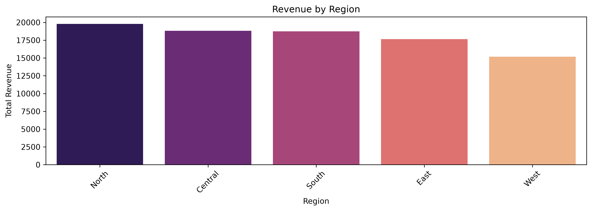
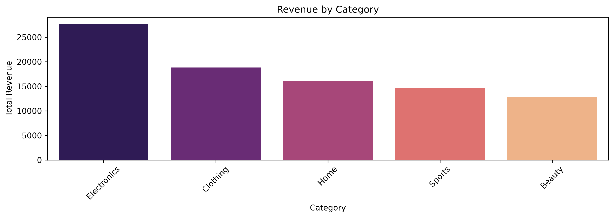

# 📊 E-Commerce Sales Analysis using Python

## 📌 Project Overview

This project performs **Exploratory Data Analysis (EDA)** on an E-Commerce Orders dataset using Python. The objective is to analyze sales performance, profitability, customer purchasing patterns, and shipping preferences to generate meaningful business insights.

The project demonstrates the complete data analysis workflow, including data cleaning, feature engineering, aggregation, visualization, and business interpretation.

---

## 🎯 Objectives

- Analyze overall revenue and profit performance.
- Identify top-performing products and categories.
- Compare sales across different regions.
- Study monthly and yearly sales trends.
- Evaluate shipping preferences.
- Generate actionable business insights through visualizations.

---

## 🛠️ Technologies Used

- Python
- Pandas
- NumPy
- Matplotlib
- Seaborn
- Jupyter Notebook

---

## 📂 Dataset

The dataset contains information about e-commerce orders, including:

- Order Date
- Product Name
- Category  
- Region
- Ship Mode
- Quantity
- Total Revenue
- Profit
- Discount %

---

## 🔧 Data Preparation

The following preprocessing steps were performed:

- Imported and explored the dataset
- Converted order dates into Year and Month
- Created a new feature:
  - Profit Margin (%)
- Grouped and aggregated business metrics using Pandas

---

## 📊 Analysis Performed

### Revenue Analysis
- Revenue by Region
- Revenue by Category
- Revenue by Product
- Revenue by Ship Mode
- Revenue by Month
- Revenue by Year

### Quantity Analysis
- Quantity Sold by Region
- Average Quantity Sold by Region

### Profit Analysis
- Profit by Region
- Profit by Category
- Profit by Product

### Profit Margin Analysis
- Profit Margin by Region
- Profit Margin by Product

### Distribution Analysis
- Count of Orders by Region
- Count of Orders by Category
- Count of Ship Mode
- Count of Orders by Month

---

## 📈 Key Business Insights

- North region generated the highest revenue and profit.
- Electronics was the highest revenue-generating category.
- Clothing produced the highest overall profit.
- Standard Shipping was the most preferred delivery option.
- Sales peaked during November and December.
- Webcam HD generated the highest revenue among all products.
- Running Shoes generated the highest overall profit.
- Beauty category recorded the highest number of orders but comparatively lower revenue, indicating lower-priced products.

---

## 📷charts visualizations

## Revenue by Region

**Insight**
- North generated the highest revenue.
- West contributed the least revenue.

## Revenue by Category

**Insight**
- Electronics generated the highest revenue.
- Beauty generated the lowest revenue.
  

## 📷 Visualizations

The project includes multiple visualizations such as:

- Bar Charts
- Count Plots
- Revenue Comparison Charts
- Profit Comparison Charts
- Quantity Analysis Charts

---

## 💼 Skills Demonstrated

- Data Cleaning
- Feature Engineering
- Exploratory Data Analysis (EDA)
- Data Aggregation using Pandas
- Data Visualization
- Business Insight Generation
- Analytical Thinking

---

## 🚀 Future Improvements

- Build an interactive Power BI dashboard.
- Perform customer segmentation.
- Analyze discount impact on profitability.
- Add correlation heatmaps.
- Predict future sales using Machine Learning.

---

## 📚 Learning Outcome

This project strengthened my understanding of:

- Python for Data Analysis
- Pandas Data Manipulation
- Seaborn & Matplotlib Visualization
- Business-Oriented Data Analysis
- Extracting insights from real-world datasets

---

## 👨‍💻 Author

**Yohan**

Aspiring Data Analyst | Python | SQL | Data Visualization | Machine Learning Enthusiast
